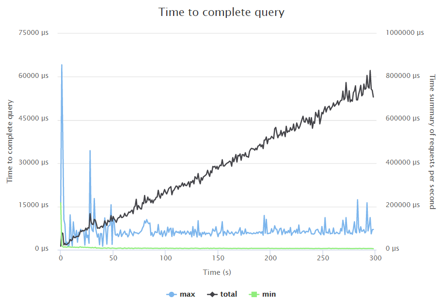
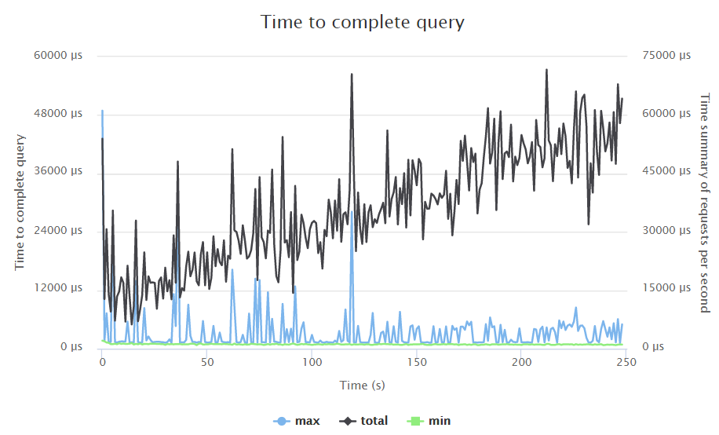
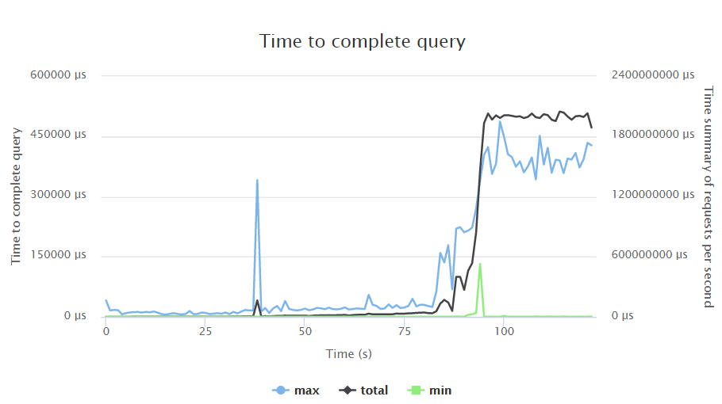

# Highload cup
Implementation of json REST API for mail.ru [highload cup](https://highloadcup.ru).
The goal was to compare vanilla [aspnet/kestrel](https://github.com/aspnet/KestrelHttpServer) Web Api implementation with other low-level
solutions (with custom routing, json serialization and parsing).
All testing performed in virtualized environment with following parameters:
Intel Xeon (4 cores 2 GHz), 4GB RAM, 10GB HDD.

The result was 182nd place, with score of 63485 seconds (the lower the better - total number of seconds spent to process queries),
1st place solution using C with sockets, 121 second. Apparently, slowest parts are built-in routing and
json serialization. Replacing with custom implementation gives boost up to 1296 seconds (145th place, [Alex K](https://goo.gl/UDgiz1)),
or even 264 seconds (83rd place, [seralexeev](https://goo.gl/2x91xq)).

## Phase one
Contains only GET queries based on known preloaded data.
Linear growth testing profile with 1-200 RPS.

Time to complete request:
* Min = 0.327 msec
* Max = 64.151 msec
* Avg = 3.658 msec
* Median = 1.291 msec

## Phase two
Contains only POST queries, updating existing data.
Constant testing profile with 100 RPS.

Time to complete request:
* Min = 0.656 msec
* Max = 48.92 msec
* Avg = 3.928 msec
* Median = 1.427 msec

## Phase three
Contains only GET queries, verifying updated data.
Linear growth testing profile with 200-2000 RPS.

Time to complete request:
* Min = 0.257 msec
* Max = 486.988 msec
* Avg = 62.749 msec
* Median = 6.427 msec

